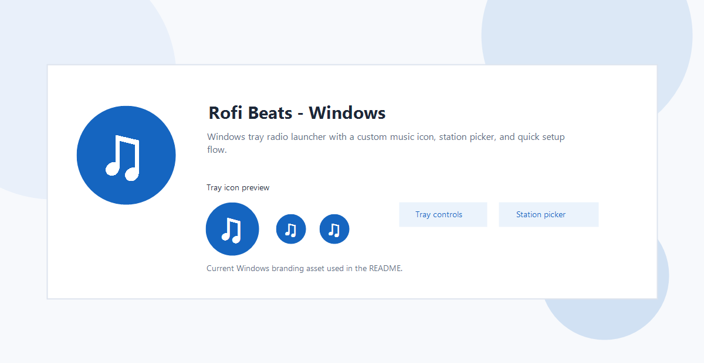

# Rofi Beats - Windows
Windows-first tray radio launcher with mood/genre discovery and Turkish public stations.
Inspired by the original Rofi-Beats idea, but reimplemented for Windows with a new PowerShell/WinForms codebase.



## Features
- System tray app (`NotifyIcon`) with right-click controls
- Music-themed tray icon
- Global hotkey: `Ctrl+Alt+B` (play/stop toggle)
- Discovery onboarding (mood + genre + recommendation style)
- Station picker with search and filters
- Expanded catalog (83 curated stations) with broader Turkish + global genre coverage
- Turkish/public station preference support
- Safer startup volume cap
- Per-app tray session-volume slider with embedded mute button via Windows Core Audio
- Live tray info (bitrate + current song title when stream metadata is available)
- State/profile persistence in `%APPDATA%\RofiBeats`

## Tray Controls
- `Play (Ctrl+Alt+B)`: start or stop playback quickly
- `Choose station...`: open the full picker with mood/genre filters
- `Session volume`: live app-only volume slider in the tray menu
- Speaker button next to the slider: mute/unmute only this app session
- `Startup volume` in the setup wizard: safe initial playback level, separate from live tray volume changes

## Requirements
- Windows 11/10
- Windows PowerShell 5.1+ (PowerShell 7 works too)
- One installed player: `VLC`, `FFplay` (FFmpeg), or `mpv`

Player detection order:
1. Known install locations (safer default)
2. `PATH`

If no player is found, app can try `winget` installation or ask you to pick `vlc.exe` / `ffplay.exe` / `mpv.exe`.

## Run
Release download:
Use the `.zip` package from GitHub Releases and extract it first.
The standalone launcher files do not work by themselves without the bundled `windows` folder.

PowerShell:
```powershell
.\rofi-beats-windows.ps1
```

Double-click / CMD:
```cmd
rofi-beats-windows.cmd
```

Foreground/debug:
```cmd
rofi-beats-windows.cmd --foreground
```

Reset profile:
```cmd
rofi-beats-windows.cmd --reset-profile
```

## Project Files
- `rofi-beats-windows.cmd`: double-click friendly launcher
- `rofi-beats-windows.ps1`: STA/bootstrap launcher
- `windows/rofi-beats-windows.ps1`: main app
- `windows/stations.json`: curated station catalog

## Station Format
Edit `windows/stations.json` to add/remove stations.

Each station should include:
- `id`
- `name`
- `url` (`http`/`https` only)
- optional tags like `moods`, `genres`, `turkish`, `public`

Invalid or duplicate station entries are skipped automatically at startup.

## License
This project is released under **GPL-3.0** to stay conservative about lineage and attribution.
See [LICENSE](LICENSE).

Inspiration:
- https://github.com/Carbon-Bl4ck/Rofi-Beats

Additional attribution details:
- [NOTICE](NOTICE)

## Security Notes
- The app does not send telemetry.
- It only plays stream URLs from local `stations.json`.
- `winget` installation is optional and user-confirmed.

Security policy:
- [SECURITY.md](SECURITY.md)

## CI
GitHub Actions workflow is included:
- Syntax validation for PowerShell launchers/app script
- Station catalog validation (`id` uniqueness + required fields + `http/https` URL checks)

## Contributing
- [CONTRIBUTING.md](CONTRIBUTING.md)

## Release Guide
- [RELEASE.md](RELEASE.md)

## Release Checklist
- Run local parse checks for both PowerShell scripts.
- Validate `windows/stations.json` (non-empty, unique `id`, valid `http/https` URLs).
- Test app manually on Windows: tray open, station play, session volume slider, mute button, stop, exit.
- Push to `main` and verify GitHub Actions passes.
